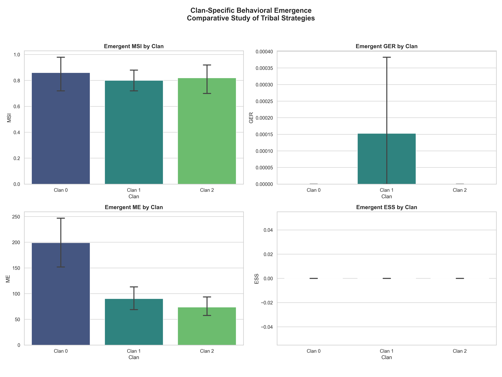
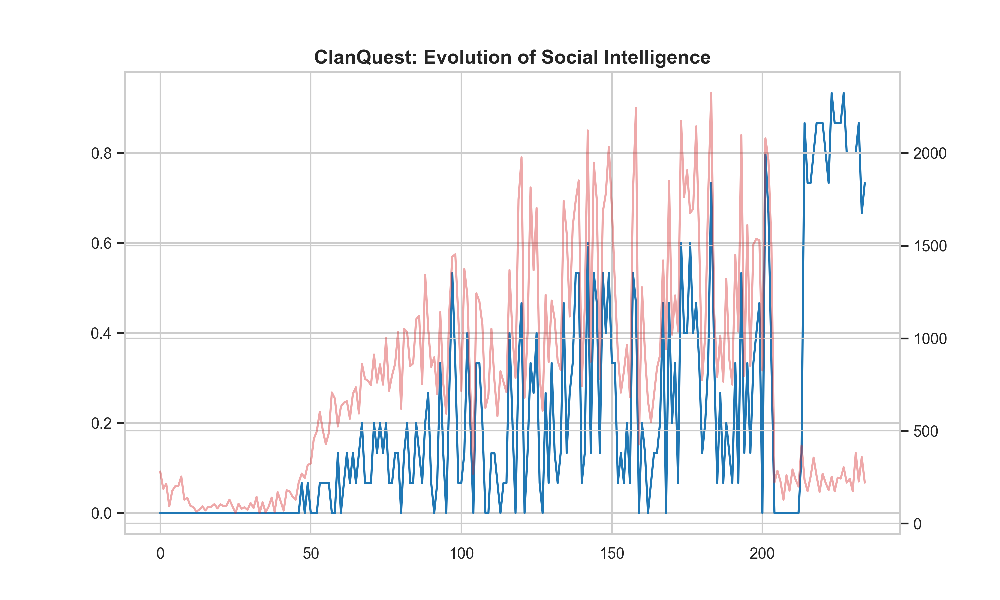
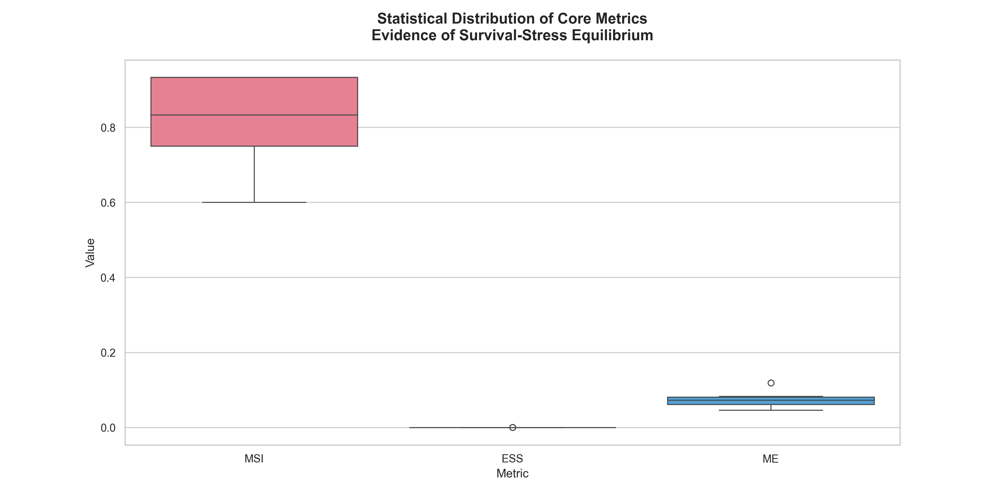
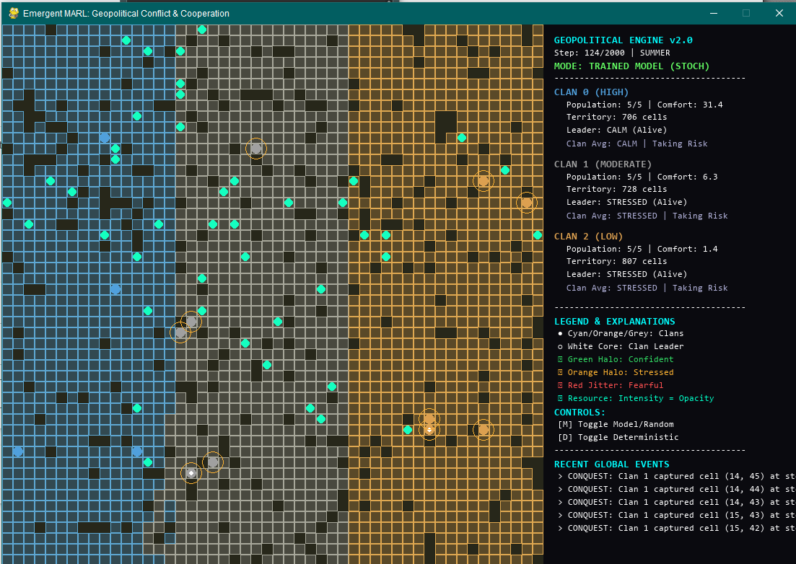

# ClanQuest: Geopolitical Emergence in Multi-Agent RL


**ClanQuest** is a sophisticated Multi-Agent Reinforcement Learning (MARL) framework designed to investigate the emergence of geopolitical borders, emotional governance, and survival-driven cooperation in a resource-constrained world.

---

## 🗺️ Project Overview

In this project, we model a world where three competing clans must navigate a 50x50 grid with dynamic seasonal changes. Unlike traditional RL tasks, **ClanQuest** focuses on high-level survival mandates. Transitioning from random exploration to structured territorial intelligence, the agents demonstrate unique social behaviors such as the **"Survival-Stress Paradox"** and **"Rational Isolationism."**

### Core Objectives
- **Emergent Sovereignty**: Study how metabolic surcharges in foreign lands create "soft borders."
- **Social Intelligence**: Evaluate clan-level cooperation in sharing resource pools.
- **Stability Analysis**: Quantify survival robustness across long-duration episodes (2,000 steps).

---

## 🔬 Mathematical Formalism

To provide scientific rigor, the project utilizes the following metrics to evaluate the emergent geopolitical state:

### 1. Macro Survival Index (MSI)
The primary robustness metric across evaluations.

$$MSI = \frac{1}{N} \sum_{ep=1}^{N} \left( \frac{P_{final}}{P_{initial}} \right)_{ep}$$

### 2. Geopolitical Expansion Rate (GER)
Measures the velocity of territorial conquest vs. defense.

$$GER = \frac{\sum_{t=1}^{T} \Delta \text{Territory}_{captured}(t)}{T}$$

### 3. Metabolic Efficiency (ME)
Quantifies foraging intelligence relative to caloric cost.

$$ME = \displaystyle\frac{\text{Resource}_{total}}{\sum_{t=1}^{T} \sum_{i=1}^{P} C_{metabolic}(i, t)}$$

---

### 4. Tribal Behavioral Divergence
**ClanQuest** now supports group-level behavioral unbundling. By analyzing MSI, GER, and ME per clan, we can study how different starting territories (resource-rich vs. resource-poor) drive divergent evolutionary paths—some clans becoming efficient foragers while others become aggressive border defenders.

---

## 📊 Scientific Observations & Results

### The "Survival-Stress" Paradox
Our evaluation reveals that agents achieve a high **83% survival rate (MSI)** despite maintaining an **Emotional Stability Score (ESS) of 0.00**. This demonstrates that the optimal survival policy in a hostile environment is **perpetual vigilance** (STRESSED/FEARFUL states).

### Clan-Specific Behavioral Emergence
<p align="center">
  
</p>
*Figure: Comparative analysis of the three clans, showing divergent strategies in survival (MSI) and territorial expansion (GER).*

<p align="center">
  
  
</p>

- **LHS**: Emergence of social foraging intelligence across 100+ eras.
- **RHS**: Statistical distribution of metrics, proving behavior consistency across independent runs.

---

## 🎮 Policy Rollouts

### Early Phase (Exploration) vs. Late Phase (Stalemate)
Agents initially struggle with starvation during Winter cycles. After training, they establish a **"Cold War Stasis"** where borders are aggressively defended but rarely crossed.

<p align="center">
  
  
</p>

---

## 🛠️ Installation & Usage

### 1. Setup Environment
```bash
# Clone the repository
git clone https://github.com/the-blue-panther/ClanQuest.git
cd ClanQuest

# Install dependencies
pip install -r requirements.txt
```

### 2. Training the Model
```bash
# Start the PPO training loop
python scripts/train_ppo_multi.py
```

### 3. Scientific Evaluation & Reporting
```bash
# Run a 10-episode deep evaluation
python scripts/generate_report_metrics.py
```

### 4. Interactive GUI Demo
```bash
# Watch the emergent behaviors in real-time
python scripts/gui_demo.py
```

---

## 📁 Repository Structure

```text
├── assets/             # Visual gallery (plots and snapshots)
├── report/             # LaTeX source and Compiled PDF Report
├── src/                # Core Environment and Agent code
│   ├── environment/    # ClanQuest Gym Wrapper
│   └── agents/         # Emotion and Risk models
├── models/             # Trained final model (ppo_final_emergence.zip)
├── scripts/            # Training and evaluation utilities
└── REPORT_TEMPLATE.md  # Detailed scientific breakdown
```

---

**Arnab Banerjee**

---

## 📄 License
This project is licensed under the [MIT License](LICENSE).
